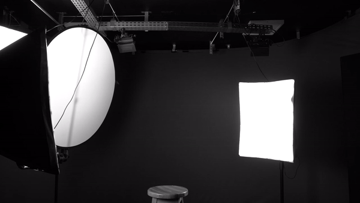

  
# Welcome to my Github!       

 
###  

### 

  
Experienced professional with more than ten years in the audiovisual production industry,
now transitioning into Computer Science. 

Experienced professional with over ten years in the audiovisual production industry, now building a strong foundation in Computer Science. I combine a decade of creative expertise in cinematography, television, and digital media with growing technical proficiency in programming, data structures, and software development. This blend of creativity and analytical thinking allows me to approach problem-solving with both innovation and precision.
  

 

  
- 💻 Student of Computer Science
- 📽️ Video Maker
- 👩‍💻 Enthusiast in Data Science

---

